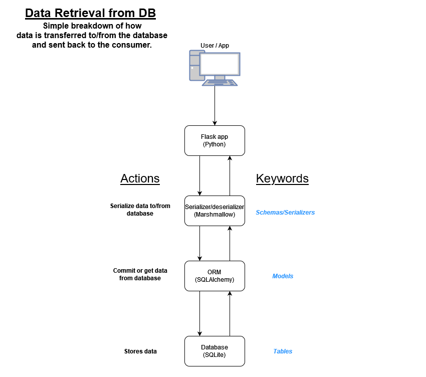

## Flask App for Network Automation
### Purpose
The purpose of this app is to learn how to build a Flask app that can gather, parse, and return network 
data to an end-user via a web interface or API. The app will be a MVP and will have plenty of room for improvement. 
Most of the app will be developed during a livestream, so there may be some components that need refactored or 
missing altogether. Feel free to open a PR and contribute!

### Use Cases
- Collect the 'show version' of a network device in our inventory and returning results to user

